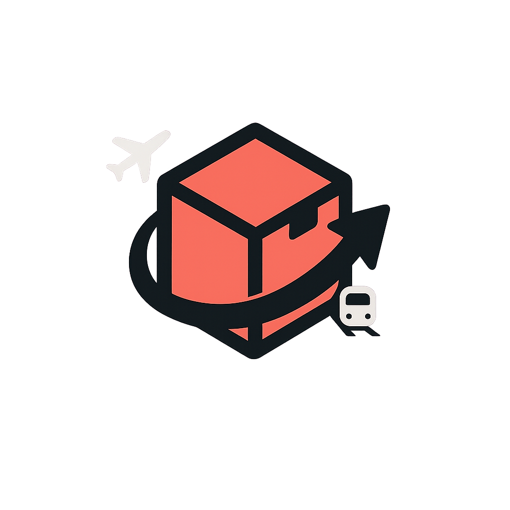
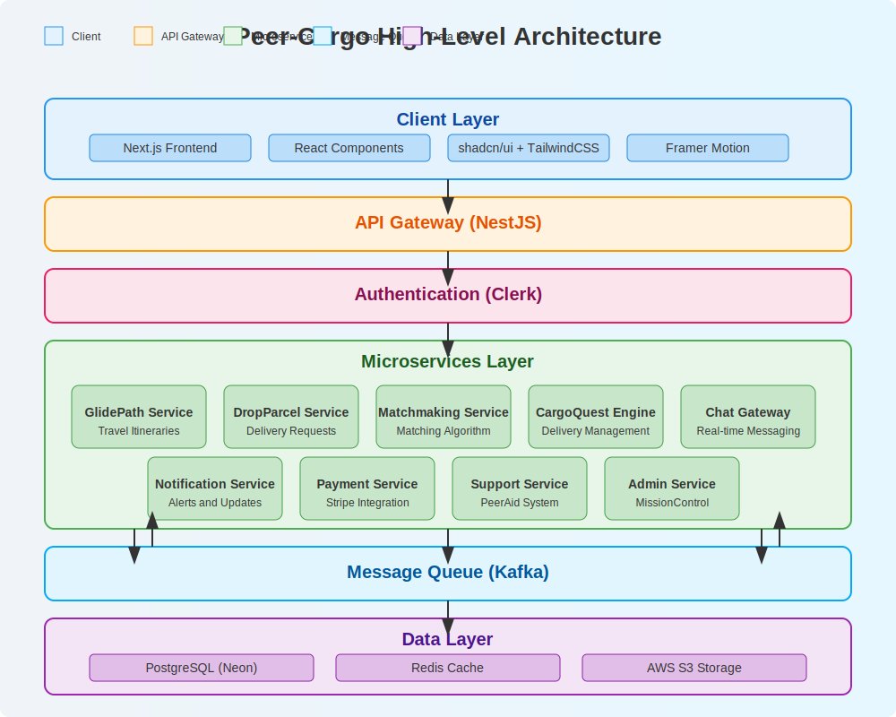

# Peer-Cargo 🚀



> **Turn Trips into Tips!**

## Overview

**🚀 Peer-Cargo** is your travel-powered delivery network — connecting everyday travelers (Carriers) with those who need to send something (Requesters). Whether you're flying across continents or commuting between cities, turn your spare luggage space into opportunity. Discover GlidePaths, drop your Parcels, chat via LinkLine, and complete trusted CargoQuests — all on one seamless platform.



## Naming Convention

| Concept          | Fancy Name     |
| ---------------- | -------------- |
| User             | Peer           |
| Sender           | Requester      |
| Receiver         | Carrier        |
| Travel Itinerary | GlidePath      |
| Delivery Job     | CargoQuest     |
| Chat Room        | LinkLine       |
| Item Request     | DropParcel     |
| Admin Portal     | MissionControl |
| Help Center      | PeerAid        |

---

## 🌟 Key Features

- **GlidePaths**: Carriers can post their travel itineraries
- **DropParcels**: Requesters can post delivery requests
- **Matching Engine**: Smart algorithm to connect GlidePaths with DropParcels
- **LinkLine**: Real-time chat system for communication
- **CargoQuest**: Finalized job tracking and management
- **MissionControl**: Admin dashboard with comprehensive analytics
- **PeerAid**: Support ticket system for user assistance

## 🛠️ Tech Stack

### Frontend

- **Next.js 14** with App Router
- **TypeScript** for type safety
- **TailwindCSS** for styling
- **shadcn/ui** for UI components
- **Framer Motion** for animations
- **Socket.io-client** for real-time features

### Backend

- **NestJS** for REST APIs and microservices
- **Prisma ORM** for database operations
- **PostgreSQL** (Neon) for primary database
- **Redis** for caching and pub/sub
- **Kafka** for event-driven architecture
- **Socket.io** with Redis Adapter for WebSockets

### Authentication & Payments

- **Clerk** for authentication
- **Stripe** for payment processing (optional, cash payments supported)

### Storage & Deployment

- **AWS S3** for file storage
- **AWS ECS/Fargate** for containerized deployment
- **GitHub Actions** for CI/CD

## 🏗️ Architecture

Peer-Cargo follows a microservices architecture to ensure scalability and maintainability.


### Services Overview:

- **Auth Service**: Handles user authentication via Clerk
- **GlidePath Service**: Manages carrier travel plans
- **DropParcel Service**: Handles delivery requests
- **Matchmaking Service**: Connects compatible GlidePaths and DropParcels
- **Chat Gateway**: Manages real-time messaging
- **CargoQuest Engine**: Tracks finalized deliveries
- **Notification Service**: Sends alerts and updates
- **Support Service**: Handles help tickets and user support

## 📱 Mobile-First Design

Peer-Cargo is built with a mobile-first approach, ensuring optimal user experience on smartphones while still providing a responsive interface on larger screens.

## 🌓 Dark Mode Support

The application includes a native dark mode using shadcn/ui theming, automatically adapting to user preferences.

## 🚀 Getting Started

### Prerequisites

- Node.js 18.x or higher
- Docker and Docker Compose
- AWS account (for production deployment)

### Development Setup

1. Clone the repository

```bash
git clone https://github.com/your-org/peer-cargo.git
cd peer-cargo
```

2. Install dependencies

```bash
pnpm install
```

3. Set up environment variables

```bash
cp .env.example .env.local
# Edit .env.local with your configuration
```

4. Start the development environment

```bash
docker-compose up -d  # Starts PostgreSQL and Redis
pnpm dev
```

5. Access the application

```
Frontend: http://localhost:3000
API: http://localhost:3001
```

### Database Setup

```bash
pnpm prisma migrate dev  # Create and apply migrations
pnpm prisma db seed      # Seed the database with sample data
```

## 📂 Project Structure

```
/peer-cargo
├── frontend/                 # Next.js frontend application
│   ├── app/                  # App router pages
│   ├── components/           # Reusable UI components
│   ├── lib/                  # Utility functions and libraries
│   ├── hooks/                # Custom React hooks
│   ├── styles/               # Global styles
│   └── public/               # Static assets
│
├── backend/                  # NestJS backend application
│   ├── src/
│   │   ├── controllers/      # API controllers
│   │   ├── services/         # Business logic
│   │   ├── middlewares/      # Custom middlewares
│   │   └── graphql/          # GraphQL schemas and resolvers
│
├── microservices/            # Individual microservices
│   ├── auth-service/         # Authentication service
│   ├── glidepath-service/    # Travel itinerary service
│   ├── dropparcel-service/   # Delivery request service
│   ├── matchmaking-service/  # Algorithm for matching
│   ├── chat-gateway/         # Real-time chat service
│   ├── cargoquest-engine/    # Job tracking service
│   ├── notification-service/ # Alerts and notifications
│   └── support-service/      # Help desk and support
│
├── libs/                     # Shared libraries
│   ├── common/               # Common utilities
│   ├── types/                # TypeScript interfaces
│   ├── utils/                # Helper functions
│   └── event-bus/            # Event handling
│
├── prisma/                   # Database schema and migrations
│   ├── schema.prisma         # Prisma schema
│   ├── migrations/           # Database migrations
│   └── seed.ts               # Seeding script
│
├── docs/                     # Documentation
│   ├── architecture-diagram.svg
│   └── hld-diagram.svg
│
├── docker/                   # Docker configuration
│   ├── Dockerfile.frontend
│   ├── Dockerfile.backend
│   └── docker-compose.yml
│
├── .github/                  # GitHub CI/CD workflows
│   └── workflows/
│       ├── ci.yml
│       └── deploy.yml
│
├── package.json              # Project dependencies
├── tsconfig.json             # TypeScript configuration
└── README.md                 # Project documentation
```

## 📊 Data Models

The primary data models in Peer-Cargo include:

- **User**: Carrier and Requester profiles
- **GlidePath**: Travel itineraries
- **DropParcel**: Delivery requests
- **Match**: Connections between GlidePaths and DropParcels
- **CargoQuest**: Finalized delivery jobs
- **Message**: Chat communications
- **Transaction**: Payment records
- **SupportTicket**: Help requests

## 🔐 Security

- JWT authentication with Clerk
- HTTPS-only API endpoints
- Rate limiting and request validation
- Data encryption for sensitive information
- GDPR compliance measures

## ⚡ Performance Optimizations

- Redis caching for frequent queries
- Server-side and client-side pagination
- Optimized asset loading with Next.js
- Efficient database indexing
- AWS CloudFront CDN integration

## 📱 Progressive Web App (PWA)

Peer-Cargo is configured as a Progressive Web App, allowing:

- Installation on mobile devices
- Offline functionality for critical features
- Push notifications for important updates

## 🌐 Internationalization

The application supports multiple languages through next-intl, with English as the default.

## 📈 Analytics

- **User Behavior**: Track user engagement and actions
- **Delivery Metrics**: Monitor successful deliveries, issues, and average delivery times
- **Financial Analytics**: Track revenue, transactions, and payment methods
- **Performance Monitoring**: System health and response times

## 📃 License

This project is licensed under the MIT License - see the LICENSE file for details.

## 🤝 Contributing

Contributions are welcome! Please read the CONTRIBUTING.md file for guidelines.

---

Built with ❤️ by the Peer-Cargo Team
