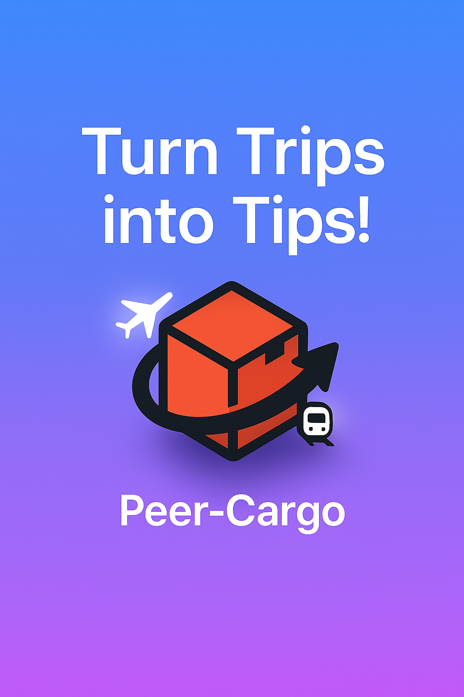

# Peer-Cargo 🚀



> **Turn Trips into Tips!**

## Overview

**🚀 Peer-Cargo** is your travel-powered delivery network — connecting everyday travelers (Carriers) with those who need to send something (Requesters). Whether you're flying across continents or commuting between cities, turn your spare luggage space into opportunity. Discover GlidePaths, drop your Parcels, chat via LinkLine, and complete trusted CargoQuests — all on one seamless platform.

[](https://opensource.org/licenses/MIT)
[](https://nextjs.org/)
[](https://nestjs.com/)
[](https://www.prisma.io/)
[](https://www.typescriptlang.org/)

## Naming Convention

| Concept          | Fancy Name     | Description                                 |
| ---------------- | -------------- | ------------------------------------------- |
| User             | Peer           | Platform user (either Carrier or Requester) |
| Sender           | Requester      | User who wants to send an item              |
| Carrier          | Carrier        | User who will transport the item            |
| Travel Itinerary | GlidePath      | Carrier's travel plans                      |
| Delivery Job     | CargoQuest     | Confirmed delivery in progress              |
| Chat Room        | LinkLine       | Real-time messaging between users           |
| Item Request     | DropParcel     | Request to deliver an item                  |
| Admin Portal     | MissionControl | Administrative dashboard                    |
| Help Center      | PeerAid        | Support ticket system                       |

---

## 🌟 Key Features

- **GlidePaths**: Carriers can post their travel itineraries
- **DropParcels**: Requesters can post delivery requests
- **Matching Engine**: Smart algorithm to connect GlidePaths with DropParcels
- **LinkLine**: Real-time chat system for communication
- **CargoQuest**: Finalized job tracking and management
- **MissionControl**: Admin dashboard with comprehensive analytics
- **PeerAid**: Support ticket system for user assistance
- **Payment Integration**: Secure payment processing via Stripe
- **Mobile-First Design**: Responsive interface optimized for all devices
- **Dark Mode**: Built-in theme switching capabilities

## 🛠️ Tech Stack

### Frontend

- **Next.js 14** with App Router for page routing
- **TypeScript** for type safety and better developer experience
- **TailwindCSS** for utility-first styling
- **shadcn/ui** for high-quality UI components
- **Framer Motion** for smooth animations and transitions
- **Socket.io-client** for real-time communication
- **Clerk** for authentication and user management

### Backend

- **NestJS** for REST APIs and microservices architecture
- **Prisma ORM** for type-safe database access
- **PostgreSQL** (Neon) for primary database storage
- **Redis** for caching and pub/sub functionality
- **Kafka** for event-driven architecture
- **Socket.io** with Redis Adapter for WebSockets

### Authentication & Payments

- **Clerk** for secure authentication and identity management
- **Stripe** for payment processing (optional, cash payments also supported)

### Storage & Deployment

- **AWS S3** for file storage
- **AWS ECS/Fargate** for containerized deployment
- **GitHub Actions** for CI/CD pipelines

## 🏗️ Architecture

Peer-Cargo follows a microservices architecture to ensure scalability, resilience, and maintainability.


### Services Overview:

- **Auth Service**: Handles user authentication and authorization via Clerk
- **GlidePath Service**: Manages carrier travel plans and itineraries
- **DropParcel Service**: Handles delivery requests creation and management
- **Matchmaking Service**: Connects compatible GlidePaths and DropParcels based on intelligent algorithms
- **Chat Gateway**: Manages real-time messaging between users
- **CargoQuest Engine**: Tracks and manages finalized deliveries
- **Notification Service**: Sends alerts and updates to users
- **Payment Service**: Processes payments via Stripe integration
- **Support Service**: Handles help tickets and user support requests

## 📱 Mobile-First Design

Peer-Cargo is built with a mobile-first approach, ensuring optimal user experience on smartphones and tablets while providing a fully responsive interface on larger screens.

## 🌓 Dark Mode Support

The application includes a native dark mode using shadcn/ui theming, automatically adapting to user preferences or allowing manual toggling.

## 🚀 Getting Started

### Prerequisites

- Node.js 18.x or higher
- Docker and Docker Compose
- AWS account (for production deployment)
- Clerk account (for authentication)
- Stripe account (for payments)

### Development Setup

1. Clone the repository

```bash
git clone https://github.com/your-org/peer-cargo.git
cd peer-cargo
```

2. Install dependencies

```bash
npm install
# or
pnpm install
```

3. Set up environment variables

```bash
cp .env.example .env.local
# Edit .env.local with your configuration
```

4. Start the development environment

```bash
docker-compose up -d  # Starts PostgreSQL and Redis
npm run dev
```

5. Access the application

```
Frontend: http://localhost:3000
```

### Database Setup

```bash
npm run prisma:generate  # Generate Prisma client
npm run prisma:migrate   # Create and apply migrations
npm run prisma:seed      # Seed the database with sample data
```

For more detailed instructions, see the [Setup Guide](./docs/setup-guide.md).

## 📂 Project Structure

```
/peer-cargo
├── app/                  # Next.js App Router pages
│   ├── (admin)/         # Admin dashboard routes
│   ├── (auth)/          # Authentication routes
│   ├── (dashboard)/     # Main application routes
│   └── api/             # API routes
├── components/          # Reusable UI components
│   ├── chat/            # Chat-related components
│   ├── forms/           # Form components
│   ├── shared/          # Shared components
│   └── ui/              # shadcn/ui components
├── lib/                 # Utility functions and services
├── prisma/              # Database schema and migrations
├── public/              # Static assets
├── styles/              # Global styles
├── docs/                # Documentation
├── microservices/       # Backend microservices
└── docker/              # Docker configuration
```

## 📊 Data Models

The primary data models in Peer-Cargo include:

- **User**: Carrier and Requester profiles
- **GlidePath**: Travel itineraries
- **DropParcel**: Delivery requests
- **Match**: Connections between GlidePaths and DropParcels
- **CargoQuest**: Finalized delivery jobs
- **Message**: Chat communications
- **Transaction**: Payment records
- **Notification**: User notifications
- **SupportTicket**: Help requests

## 🔐 Security Features

- JWT authentication with Clerk
- HTTPS-only API endpoints
- Rate limiting and request validation
- Data encryption for sensitive information
- GDPR compliance measures
- Secure payment processing with Stripe

## ⚡ Performance Optimizations

- Redis caching for frequent queries
- Server-side and client-side pagination
- Optimized asset loading with Next.js
- Efficient database indexing
- AWS CloudFront CDN integration
- Lazy loading of components and routes

## 📱 Progressive Web App (PWA)

Peer-Cargo is configured as a Progressive Web App, allowing:

- Installation on mobile devices
- Offline functionality for critical features
- Push notifications for important updates
- Fast load times with service workers

## 📈 Analytics and Monitoring

- **User Behavior**: Track user engagement and conversion
- **Delivery Metrics**: Monitor successful deliveries, issues, and average delivery times
- **Financial Analytics**: Track revenue, transactions, and payment methods
- **Performance Monitoring**: System health and response times
- **Error Tracking**: Capture and analyze application errors

## 🚀 Deployment

Peer-Cargo can be deployed to various environments:

### AWS Deployment

1. Configure AWS credentials
2. Set up ECR repository
3. Create ECS cluster and service
4. Deploy using GitHub Actions workflow

```bash
# Push to main branch to trigger deployment
git push origin main
```

### Local Deployment

```bash
# Build Docker image
docker build -t peer-cargo -f docker/Dockerfile .

# Run Docker container
docker run -p 3000:3000 peer-cargo
```

## 🌐 API Documentation

API documentation is available at `/api/docs` when running in development mode. It includes details on all available endpoints, request/response schemas, and authentication requirements.

## 🧪 Testing

```bash
# Run unit tests
npm run test

# Run end-to-end tests
npm run test:e2e

# Generate test coverage report
npm run test:cov
```

## 🤝 Contributing

Contributions are welcome! Please read the [CONTRIBUTING.md](./CONTRIBUTING.md) file for guidelines on how to contribute to Peer-Cargo.

1. Fork the repository
2. Create a feature branch (`git checkout -b feature/amazing-feature`)
3. Commit your changes (`git commit -m 'Add some amazing feature'`)
4. Push to the branch (`git push origin feature/amazing-feature`)
5. Open a Pull Request

## 📃 License

This project is licensed under the MIT License - see the [LICENSE](./LICENSE) file for details.

## 🙏 Acknowledgements

- [Next.js](https://nextjs.org/)
- [NestJS](https://nestjs.com/)
- [Prisma](https://www.prisma.io/)
- [TailwindCSS](https://tailwindcss.com/)
- [shadcn/ui](https://ui.shadcn.com/)
- [Framer Motion](https://www.framer.com/motion/)
- [Clerk](https://clerk.dev/)
- [Stripe](https://stripe.com/)

---

Built with ❤️ by the Peer-Cargo Team
